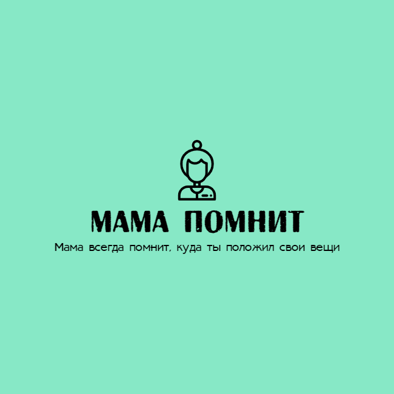

# **Бекэнд для приложения Мама помнит**
# ****
## Приложение для тех, кто не хочет забыть, куда положил вещи. Создавай заметки, добавляй фото, название, описание и геолокацию, а мама запомнит и подскажет тебе, где искать, когда это будет необходимо.

### **Функциональные возможности.**

Приложение позволяет создавать карточки вещей с информацией о них и их местоположении,
запрашивать списки вещей по категориям, редактировать ранее записанную информацию.

### **Технические особенности.**

Проект на Java 11 + Spring Boot, RESTful API, сборщик Maven. Hibernate,
JPA repository, PostgreSQL, MapStruct. Контейнеризация через Docker. Кэширование на Redis.

### **Инструкция по сборке:**

1) Вы можете скачать проект в zip архиве нажав на главной странице проекта зеленую кнопку code -> download zip
2) Откройте проект с помощью своей IDE и дождитесь, пока загрузятся все необходимые данные. В случае,
   если вы используете IntelliJ IDEA значки файлов "посинеют" после загрузки всего необходимого.
3) Для запуска проекта требуется JDK не ниже версии 11.
4) Для того чтобы запустить локально данную программу, вам потребуется настроить Redis на своем устройстве, для корректной
   работы кэша. Для запуска в docker контейнере вам не понадобиться этого делать. Вы можете настроить Redis по
   инструкции с официального сайта: https://redis.io/docs/getting-started/installation/install-redis-on-windows/
5) Локально программа работает с H2 Database, а в Docker с PostgreSQL, просто запустите класс
   MapOfAttractionsApplication.
6) Если вы хотите воспользоваться БД PostgreSQL без установки на ПК, то сгенерируйте образ Docker зайдя в файл
   docker-compose.yml и нажав на двойной зеленый треугольник рядом с названием "services".
7) Также доступен swagger, достаточно просто перейти по ссылке: http://localhost:8080/swagger-ui/index.html#